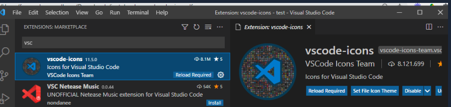

# Automation-Back-end-Zitrus

Project - Automation Back-end Zitrus

    Este projeto, foi desenvolvido para o cliente: Zitrus. Neste projeto, o objetivo é checar as habilidades básicas de automação e cenários de testes.

# Requisitos do Projeto

- [X] Implementar testes automatizados de back-end (API Rest), utilize a ferramenta de sua preferência
- [X] Utilizar a api do github para realizar os testes (https://docs.github.com/en/rest)
- [X] Criação de um repositorio no github
- [X] Consulta do repositorio criado
- [X] Criação de uma issue no respositorio recém criado
- [X] Consulta da issue
- [X] Exclusão do repositorio
- [X] Consultar se o repositorio foi eliminado

# Estrutura do Projeto:

1 - Camada de services: são os métodos possíveis para cada endpoint de uma api, devem ser criados de acordo com os parametros necessários para suas execuções.

2 - Camada de specification: são arquivos por feature, contendo os BDDs que devem ser criados para cada cenário, tendo sempre o cuidade de gerar o maior reaproveitamento possível

3 - Camada de steps: uma vez criada as especificações, na camada de steps serão implementados cada passo necessário para se chegar ao resultado esperado.

4 - Camada de support: onde se encontram insumos necessários para nossa automação de testes, tais como, config, massa, payloads, spec_helper e env.

4.1 - Config: são definidos os endpoints e suas rotas e também a URL base da aplicação.

4.2 - Massa: nessa camada, podem ser definidos as massas de testes importantes quando possuem diferentes dados de acordo com o ambiente a ser executado.

4.3 - Payloads: são os arquivos .yml que são utilizados para a definição do Body nas requisições do tipo Post e Put

4.4 - Spec_helper: nesse ponto são instanciadas as classes definidas na camada de service para a execução dos métodos criados

4.5 - Env: são as configurações para a execução do projeto, obs.: geralmente não sofre alterações.

5 - Reports: o cucumber já possui um report nativo, que é gerado em html, nessa pasta são gerados esses reports

6 - Reports_allure: são os arquivos necessários para a execução do report do allure

7 - .gitlab: são as configurações para a execução do projeto ao publicarmos no repositório correspondente

8 - Cucumber.yml: são as configurações para a execução dos testes pelo cucumber.

9 - Gemfile: contém todas as dependencias necessária para o projeto.

Comandos para a execução: cucumber - executa dos os testes já criados cucumber -t @tag - executa os cenários que possuam a tag informada (essa tag deve estar no arquivo .feature acima do cenário desejado) allure server reports_allure - iniciar o allure report

# Execução do projeto:

    Configuração da máquina para execução do projeto:

## ***CMDER***

#### ***1- Baixe o Console CMDER na sua máquina (Emulador)***

[https://cmder.app/](https://cmder.app/)

## ***Configurando o Windows***

#### *** 1- Instalar Ruby***

#### ***Acessar o link ***[https://rubyinstaller.org/downloads/](https://rubyinstaller.org/downloads/)

#### ***Selecione a versão (3.1.2 - utilizado atualmente) ***

Aguarde a versão ser baixada e instale ela

***De um Enter no console aberto após finalizar a instalação Enter novamente***

## ***Visual Studio Code***

#### ***Instalando Visual Studio Code e Plugins***

#### Acessar o link [***https://code.visualstudio.com/DOWNLOAD***](https://code.visualstudio.com/DOWNLOAD "https://code.visualstudio.com/DOWNLOAD")

#### ***Baixar Windows e instalar (No caso de quem esta com sistema operacional windows, quem não estiver selecionar a opção que referente ao sistema da sua máquina)***

#### ***Abrir o Visual Studio Code e instalar os seguintes plugins***

#### ***Instalar o Plugin Ruby***

Caminho para instalar os plugins , clique no ícone demostrado abaixo:

#### ***Instalar o plugin do cucumber***

***Instalar o plugin vscode icons***

## ***Instalando Capybara***

#### ***Abrir o console e Inserir  ***`gem install capybara`*** em seguida clicar em Enter***

## ***Instalando Rspec***

#### ***Abrir o console e Inserir  ***`gem install rspec`*** em seguida clicar em Enter***

## ***Instalando os drivers***

#### ***ChromerDriver***

#### ***Acessar o link ***[ChromeDriver - WebDriver for Chrome - Downloads](https://chromedriver.chromium.org/downloads)***  e baixar a versão compatível com seu navegador***

***EXTRAIA O ARQUIVO DENTRO DA PASTA USR/LOCAL/BIN PARA MAC E LINUX. PARA WINDOWS APENAS EXTRAIA DENTRO DA PASTA C:/WINDOWS.***

## ***Instalando Mozila***

#### Acessar o link [***https://github.com/mozilla/geckodriver/releases***](https://github.com/mozilla/geckodriver/releases "https://github.com/mozilla/geckodriver/releases")

#### ***Baixar a versão referente ao seu sistema operacional***

# Execução Testes:

 Cucumber - executa dos os testes já criados cucumber -t @tag - executa os cenários que possuam a tag informada (essa tag deve estar no arquivo .feature acima do cenário desejado) allure server reports_allure - iniciar o allure report

# Desafios encontrados durante o teste:

* A api do github, possui algumas instabilidade, o que demorou para validar os testes
* Não ter recebido as collections das api, foi necessário montar e validar.
* Criar conta, para disponibilizar para a Empresa nos testes.
